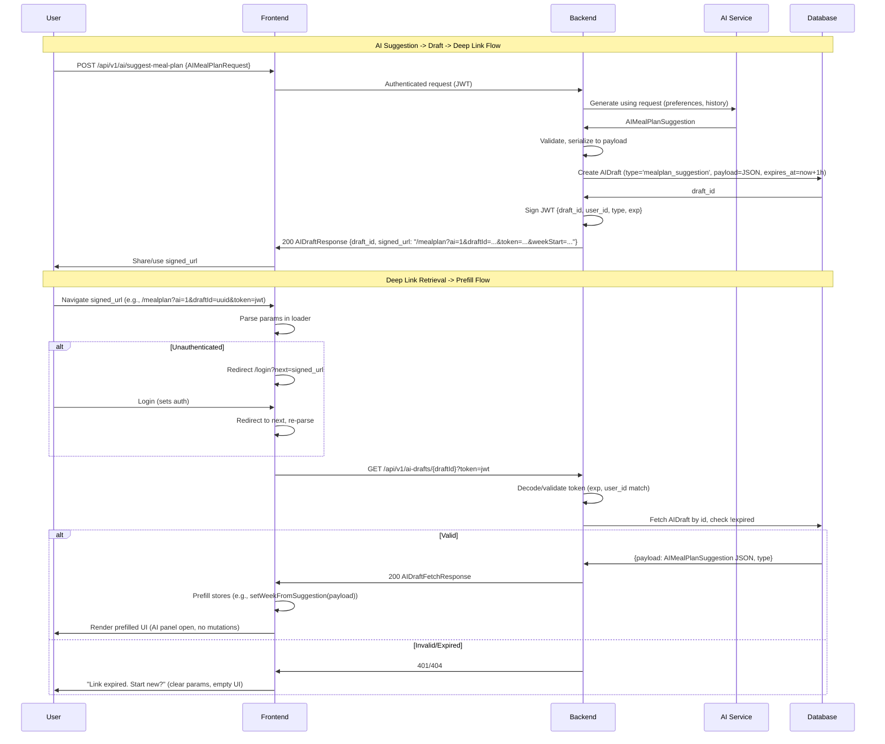

# Unified AI Suggestions via Signed Deep Links for Drafts

## Status
Proposed

## Context
PantryPilot is an AI-assisted meal planning service that enables users to import/create recipes, capture preferences/dietary constraints, generate personalized weekly meal plans with swaps, track cooked meals/leftovers, and produce grocery lists while respecting time/budget constraints. The system emphasizes user-owned data privacy with authenticated access and no default sharing.

Existing backend structures (FastAPI with Pydantic schemas in `apps/backend/src/schemas/` like `mealplans.py`, `recipes.py`, `user_preferences.py`) support models such as `Recipe` (with `IngredientOut`, difficulty, category), `WeeklyMealPlanOut` (with `DayPlanOut` and `MealEntryOut`), and `UserPreferencesResponse`. API endpoints under `/api/v1/` handle meal plans (`mealplans.py`), recipes (`recipes.py`), and auth (JWT via `core/security.py`). Frontend uses React Router (`routerConfig.tsx`) with loaders for data fetching, Zustand stores (`useMealPlanStore`, `useRecipeStore`), and API hooks (`useApi.ts`, `useAuthStore.ts`).

The introduction of AI-driven suggestions requires integrated contracts for generation (inputs: preferences/history; outputs: meal plans/recipes) and secure sharing via deep links. Previously separate concerns—AI suggestion contracts (ADR 001) and signed deep links for drafts (ADR 002)—are unified here to enable a seamless flow: backend AI generates suggestions as drafts, stores them securely, produces signed short-lived links, and frontend retrieves/prefills without side effects. This ensures personalization, validation, and explicit user actions while avoiding URL exposure of sensitive data.

Key challenges:
- Align AI outputs with existing schemas for persistence (e.g., map suggestions to `RecipeOut`/`WeeklyMealPlanOut`).
- Secure draft sharing: TTL (1h), signed JWTs, no PII in URLs.
- Frontend: Parse intents (`?ai=1&draftId=...`), fetch drafts, prefill forms (e.g., `MealPlanPage`, `RecipeNewPage`), handle auth redirects.
- Non-goals: AI model details, full implementation (focus on contracts/architecture); no mutations on link load.

This ADR supersedes [ADR 001: AI Suggestion Contracts](docs/adr/2025-09-11-ai-suggestion-contracts.md) and [ADR 002: Deep Links for AI Drafts](docs/adr/2025-09-11-deep-links-for-ai-drafts.md).

## Decision
Adopt an integrated pattern where AI suggestion endpoints generate content using defined contracts, automatically create `AIDraft` records with suggestion payloads, and return signed deep links. Frontend routes parse parameters to fetch and prefill drafts securely. All schemas in `apps/backend/src/schemas/ai.py`; new model `AIDraft` in `src/models/ai_drafts.py`; endpoints under `/api/v1/ai/`; extend `core/security.py` for draft tokens; frontend loaders in `routerConfig.tsx`.

### Unified Contracts
Schemas extend existing ones (e.g., `UserPreferencesResponse`, `RecipeOut`, `MealEntryOut`) for compatibility. Use `ConfigDict(extra="forbid")` and `Field(description=...)` for strictness.

#### Input Schemas
1. **AISuggestionRequest** (Base):
   ```python
   from datetime import date
   from typing import List, Dict, Any, Optional
   from uuid import UUID

   from pydantic import BaseModel, Field

   class AISuggestionRequest(BaseModel):
       user_id: UUID = Field(..., description="User identifier")
       start_date: date = Field(..., description="Planning start date")
       preferences: UserPreferencesResponse = Field(..., description="User preferences/constraints")
       meal_history: Optional[List[MealHistoryOut]] = Field(default=None, description="Recent history to avoid repeats")
       user_recipes: Optional[List[RecipeOut]] = Field(default=None, description="Existing recipes for basing suggestions")
       constraints: Optional[Dict[str, Any]] = Field(default=None, description="Additional constraints (budget/time)")

       model_config = ConfigDict(extra="forbid")
   ```

2. **AIMealPlanRequest** (Extends `AISuggestionRequest`):
   ```python
   class AIMealPlanRequest(AISuggestionRequest):
       num_days: int = Field(default=7, ge=1, le=30, description="Days to plan")
       meals_per_day: int = Field(default=1, ge=1, le=3, description="Meals per day")
   ```

3. **AIRecipeSuggestionRequest** (Extends `AISuggestionRequest`):
   ```python
   class AIRecipeSuggestionRequest(AISuggestionRequest):
       prompt: Optional[str] = Field(default=None, description="User prompt for generation")
       base_on_recipe: Optional[RecipeOut] = Field(default=None, description="Recipe to modify")
       category: Optional[RecipeCategory] = Field(default=None, description="Target category")
   ```

4. **AIDraftCreate** (For draft creation, embeds suggestion request; AI generates payload):
   ```python
   from typing import Literal
   from datetime import datetime

   class AIDraftCreate(BaseModel):
       type: Literal['mealplan_suggestion', 'recipe_suggestion'] = Field(..., description="Draft type")
       suggestion_request: AISuggestionRequest = Field(..., description="Embedded request for AI generation")
       # AI backend will populate payload from generation

       model_config = ConfigDict(extra="forbid")
   ```

#### Output Schemas
1. **AIMealSuggestion** (Individual meal):
   ```python
   from enum import Enum
   from typing import Literal

   class AIMealType(str, Enum):
       DINNER = "dinner"
       # Extend: LUNCH, etc.

   class AIMealSuggestion(BaseModel):
       planned_for_date: date = Field(..., description="Planned date")
       meal_type: AIMealType = Field(..., description="Meal type")
       suggested_recipe: Optional[RecipeOut] = Field(default=None, description="Existing recipe")
       generated_recipe: Optional['AIGeneratedRecipe'] = Field(default=None, description="AI-generated recipe")
       confidence_score: float = Field(..., ge=0.0, le=1.0, description="AI confidence")
       alternatives: List['AIRecipeSuggestion'] = Field(default_factory=list, description="Alternatives")
       rationale: str = Field(..., description="Explanation")
       estimated_prep_time: Optional[int] = Field(default=None, ge=0, description="Prep time (min)")

       model_config = ConfigDict(extra="forbid")
   ```

2. **AIDaySuggestion**:
   ```python
   class AIDaySuggestion(BaseModel):
       date: date = Field(..., description="Day date")
       day_of_week: Literal["Sunday", "Monday", "Tuesday", "Wednesday", "Thursday", "Friday", "Saturday"] = Field(..., description="Day label")
       entries: List[AIMealSuggestion] = Field(..., description="Day meals")

       model_config = ConfigDict(extra="forbid")
   ```

3. **AIMealPlanSuggestion** (Aligns with `WeeklyMealPlanOut`):
   ```python
   class AIMealPlanSuggestion(BaseModel):
       week_start_date: date = Field(..., description="Week start")
       days: List[AIDaySuggestion] = Field(min_length=1, description="Weekly days")
       overall_rationale: str = Field(..., description="Plan explanation")
       total_estimated_cost: Optional[float] = Field(default=None, description="Estimated cost")
       grocery_guidance: Optional[str] = Field(default=None, description="Grocery summary")

       model_config = ConfigDict(extra="forbid")
   ```

4. **AIGeneratedRecipe** (Extends `RecipeCreate`):
   ```python
   class AIGeneratedRecipe(RecipeCreate):
       is_ai_generated: bool = Field(default=True, description="AI flag")
       ai_confidence: float = Field(..., ge=0.0, le=1.0, description="Generation confidence")
       source_prompt: Optional[str] = Field(default=None, description="Generation prompt")
   ```

5. **AIRecipeSuggestion**:
   ```python
   class AIRecipeSuggestion(BaseModel):
       title: str = Field(..., min_length=1, description="Title")
       ingredients: List[IngredientOut] = Field(..., description="Ingredients")
       instructions: List[str] = Field(min_length=1, description="Instructions")
       estimated_prep_time: int = Field(..., ge=0, description="Prep time")
       estimated_cook_time: int = Field(..., ge=0, description="Cook time")
       difficulty: RecipeDifficulty = Field(..., description="Difficulty")
       category: RecipeCategory = Field(..., description="Category")
       confidence_score: float = Field(..., ge=0.0, le=1.0, description="Confidence")
       rationale: str = Field(..., description="Fit rationale")

       model_config = ConfigDict(extra="forbid")
   ```

6. **AIRecipeSuggestionResponse**:
   ```python
   class AIRecipeSuggestionResponse(BaseModel):
       generated_recipe: AIGeneratedRecipe = Field(..., description="Primary recipe")
       similar_existing: Optional[List[RecipeOut]] = Field(default=None, description="Similar recipes")
       alternatives: List[AIRecipeSuggestion] = Field(default_factory=list, description="Alternatives")

       model_config = ConfigDict(extra="forbid")
   ```

7. **AIDraftResponse** (From suggest endpoint):
   ```python
   class AIDraftResponse(BaseModel):
       draft_id: UUID = Field(..., description="Draft ID")
       signed_url: str = Field(..., description="Deep link, e.g., /mealplan?ai=1&draftId=...&token=...")
       expires_at: datetime = Field(..., description="Expiration time")

       model_config = ConfigDict(extra="forbid")
   ```

8. **AIDraftFetchResponse** (From GET /ai-drafts/{id}):
   ```python
   class AIDraftFetchResponse(BaseModel):
       payload: Dict[str, Any] = Field(..., description="Suggestion payload (AIMealPlanSuggestion or AIRecipeSuggestionResponse as JSON)")
       type: Literal['mealplan_suggestion', 'recipe_suggestion'] = Field(..., description="Draft type")

       model_config = ConfigDict(extra="forbid")
   ```

#### API Endpoints
- **POST /api/v1/ai/suggest-meal-plan**: Input `AIMealPlanRequest`, generates via AI using contracts, creates `AIDraft` (type='mealplan_suggestion', payload=JSON-serialized `AIMealPlanSuggestion`), stores, signs JWT, returns `AIDraftResponse` (wrapped in `ApiResponse`). Auth required (user_id from token).
- **POST /api/v1/ai/suggest-recipe**: Input `AIRecipeSuggestionRequest`, similar flow, type='recipe_suggestion', payload=`AIRecipeSuggestionResponse`.
- **GET /api/v1/ai-drafts/{draft_id}**: Validates signed token from query (exp, user_id), fetches `AIDraft`, checks !expired, returns `AIDraftFetchResponse`. Raises 401/404 on invalid/expired.
- Error handling: HTTP 422 (validation), 500 (AI failure with "Generation failed"), 401/404 (auth/expired).

#### Database Model
New `AIDraft` in `src/models/ai_drafts.py` (add via Alembic):
```python
from sqlalchemy import Column, String, JSON, DateTime, ForeignKey
from sqlalchemy.dialects.postgresql import UUID as PG_UUID
from sqlalchemy.sql import func
from uuid import uuid4
from .base import Base

class AIDraft(Base):
    __tablename__ = "ai_drafts"
    id = Column(PG_UUID(as_uuid=True), primary_key=True, default=uuid4)
    user_id = Column(PG_UUID(as_uuid=True), ForeignKey('users.id'), nullable=False, index=True)
    type = Column(String(20), nullable=False, index=True)  # 'mealplan_suggestion' | 'recipe_suggestion'
    payload = Column(JSON, nullable=False)  # JSONB for suggestion data
    created_at = Column(DateTime(timezone=True), server_default=func.now())
    expires_at = Column(DateTime(timezone=True), nullable=False)  # now + 1h
```
CRUD in `src/crud/ai_drafts.py`. Purge expired via cron or on fetch.

### Architecture
- **Backend**:
  - New router `src/api/v1/ai.py` (for suggest endpoints) and `ai_drafts.py` (for drafts), mounted in `api.py`.
  - Suggest flow: Validate request, call AI (internal/external), serialize output to payload, create AIDraft (expires_at=now+timedelta(hours=1)), generate signed_url.
  - Signing: Extend `core/security.py` with `create_draft_token(draft_id: UUID, user_id: UUID, exp_delta: timedelta = timedelta(hours=1)) -> str` (HS256, SECRET_KEY; payload: {"draft_id": ..., "user_id": ..., "type": ..., "exp": ...}).
  - GET: Decode token (verify signature/exp), match user_id (from token or auth), fetch by id, return payload if valid.
  - Persistence: Map suggestions to existing models on user save (e.g., POST /recipes for generated_recipe, then /mealplans).

- **Frontend**:
  - Extend `routerConfig.tsx`: Add loaders for `/mealplan` and `/recipes/new` to parse `useSearchParams()` for `ai`, `draftId`, `token`, intent params (e.g., `weekStart`, `prompt`).
  - If `ai=1` && `draftId`, use new `api/endpoints/aiDrafts.ts` (via `useApi`) to fetch; on success, prefill stores (e.g., `useMealPlanStore.setWeekFromSuggestion(payload)`, `useRecipeStore.setFormFromSuggestion(payload)`). Show AI panel/indicator.
  - Auth: In `ProtectedRoute` or page, if !authenticated && ai intent, `navigate(`/login?next=${encodeURIComponent(currentUrl)}`)`. Post-login, redirect via `next` in `useAuthStore`.
  - No side effects: Prefill sets read-only initial state; user confirms via "Save Plan" or "Create Recipe" to mutate.
  - Fallback: Invalid/expired -> "Link expired. Start new?" (clear params, load empty form).

- **Security/Constraints**:
  - TTL: 1h (env-configurable).
  - JWT: Includes draft_id/user_id/type/exp; validate against DB on fetch.
  - URL: No sensitive data; params <2KB; prefer server drafts over URL payloads.
  - Privacy: Operations scoped to user_id; anonymize AI prompts.

### Flows


### Documented Patterns
- **Deep Link Examples**:
  - Meal Plan: `/mealplan?ai=1&draftId=uuid&token=jwt&weekStart=2025-09-15` (prefills week from draft).
  - Recipe: `/recipes/new?ai=1&draftId=uuid&token=jwt&prompt=Quick vegetarian dinner` (opens new recipe form with AI suggestion).
  - Intent-only (no draft): `/mealplan?ai=suggest-week&weekStart=2025-09-15` (triggers on-load AI call, no prefill).
- **Rules**: `ai=1` enables AI mode; `draftId+token` fetches server draft; intent params (e.g., `prompt`, `weekStart`) for direct use; protected routes require auth (redirect preserves link); non-AI routes ignore params; explicit user action (e.g., "Apply Suggestion") to save.

## Consequences
- **Positive**:
  - Secure, shareable AI suggestions: Signed links enable seamless UX (e.g., email "Your AI meal plan") without data leaks.
  - Type-safe integration: Unified schemas ensure compatibility with existing models/UI; JSON payloads flexible for future extensions (e.g., nutrition).
  - Privacy/User Control: TTL limits exposure; prefill only (no auto-save); scoped to user_id.
  - Extensibility: Supports new types/intents; aligns with current auth/routing.

- **Negative/Trade-offs**:
  - Added complexity: New model/endpoints/schemas (~1-2 days backend, ~1 day frontend); requires Alembic migration/tests.
  - Overhead: Short-lived DB entries (purge needed); JWT ops minor perf impact.
  - Edge cases: Handle expiry mid-session (refetch?), URL length (truncate prompts), AI failures (fallback to empty).

- **Risks**:
  - AI variability: Mitigated by confidence/rationale/user review before persist.
  - Security: JWT tampering (signature protects); monitor for token leaks.
  - Adoption: Ensure patterns documented in README/UI guides.
  - Cost: AI calls; track via logging.

Implementation: Review/approve this ADR, then switch to Code mode for schemas/model/endpoints/routing.
